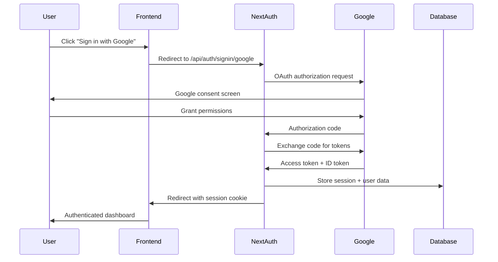

# Mustache Cashstage API Documentation

## Overview

Mustache Cashstage uses a **hybrid API architecture** designed for performance, reliability, and scalability. Our API consists of two main components that work together to provide comprehensive marketing analytics capabilities.

## Architecture

### 🏗️ **Hybrid API Design**

```
┌─────────────────────┐    ┌──────────────────────┐
│   Next.js API      │    │    NestJS API        │
│   (Port 3000)      │    │    (Port 3001)       │
│                     │    │                      │
│ • Dashboard CRUD    │    │ • Data Ingestion     │
│ • Widget Management │    │ • Background Jobs    │
│ • Data Sources      │    │ • Health Monitoring  │
│ • Authentication    │    │ • System Metrics     │
│ • User Management   │    │ • Anti-fragile Ops   │
└─────────────────────┘    └──────────────────────┘
           │                          │
           └────────┬──────────────────┘
                    │
         ┌──────────▼──────────┐
         │   PostgreSQL DB     │
         │   Redis Cache       │
         └─────────────────────┘
```

### 🎯 **Design Principles**

- **Anti-fragile Operations**: Self-healing systems with comprehensive monitoring
- **Request Tracing**: Every request gets a unique traceId for debugging
- **Organization Isolation**: Multi-tenant architecture with data separation
- **Performance-First**: Intelligent caching and optimized queries
- **Security by Default**: Authentication, authorization, and input validation

## 🚀 Quick Start

### Base URLs

| Environment | Next.js API | NestJS API | Purpose |
|-------------|-------------|------------|---------|
| **Development** | `http://localhost:3000/api` | `http://localhost:3001/api/v1` | Local development |
| **Staging** | `https://staging.mustache-cashstage.dev/api` | `https://api-staging.mustache-cashstage.dev/api/v1` | Testing |
| **Production** | `https://app.mustache-cashstage.dev/api` | `https://api.mustache-cashstage.dev/api/v1` | Live service |

### Authentication

All API requests require authentication except for health checks and public endpoints.

#### **Session-Based (Next.js API)**
```bash
# Authentication is handled via session cookies
# Use NextAuth.js authentication flow
curl -X GET "http://localhost:3000/api/dashboards" \
  -H "Cookie: next-auth.session-token=your-session-token"
```

#### **JWT-Based (NestJS API)**
```bash
# Include JWT token in Authorization header
curl -X POST "http://localhost:3001/api/v1/data-ingestion/google-sheets" \
  -H "Authorization: Bearer your-jwt-token" \
  -H "Content-Type: application/json" \
  -d '{"spreadsheetUrl": "https://docs.google.com/spreadsheets/d/...", "organizationId": "org-123"}'
```

### Rate Limits

| Tier | Limit | Window | Scope |
|------|-------|--------|-------|
| **Per Second** | 10 requests | 1 second | Per IP |
| **Per Minute** | 100 requests | 1 minute | Per IP |
| **Burst Protection** | 1000 requests | 15 minutes | Per IP |

## 📋 API Reference

### Next.js API Routes (`/api/*`)

#### **Authentication**

##### **NextAuth.js Endpoints**
```http
GET  /api/auth/[...nextauth]     # Authentication provider
POST /api/auth/[...nextauth]     # Authentication callback
```

---

#### **Dashboards**

##### **List Dashboards**
```http
GET /api/dashboards
```

**Response:**
```json
{
  "success": true,
  "data": [
    {
      "id": "dashboard-123",
      "name": "Q1 Performance Dashboard",
      "description": "Quarterly marketing performance overview",
      "organizationId": "org-456",
      "createdAt": "2024-01-15T10:30:00Z",
      "updatedAt": "2024-01-20T14:22:00Z",
      "tabs": [
        {
          "id": "tab-789",
          "name": "Overview",
          "widgets": [...],
          "order": 0
        }
      ]
    }
  ],
  "meta": {
    "total": 5,
    "page": 1,
    "limit": 20
  }
}
```

##### **Create Dashboard**
```http
POST /api/dashboards
```

**Request:**
```json
{
  "name": "New Dashboard",
  "description": "Dashboard description",
  "template": "marketing-overview" // optional
}
```

**Response:**
```json
{
  "success": true,
  "data": {
    "id": "dashboard-new",
    "name": "New Dashboard",
    "description": "Dashboard description",
    "organizationId": "org-456",
    "tabs": [
      {
        "id": "tab-default",
        "name": "Overview",
        "widgets": [],
        "order": 0
      }
    ],
    "createdAt": "2024-01-21T09:15:00Z",
    "updatedAt": "2024-01-21T09:15:00Z"
  }
}
```

##### **Get Dashboard**
```http
GET /api/dashboards/{dashboardId}
```

##### **Update Dashboard**
```http
PUT /api/dashboards/{dashboardId}
```

##### **Delete Dashboard**
```http
DELETE /api/dashboards/{dashboardId}
```

---

#### **Data Sources**

##### **List Data Sources**
```http
GET /api/data-sources
```

**Response:**
```json
{
  "success": true,
  "data": [
    {
      "id": "ds-123",
      "name": "Google Ads Performance",
      "type": "google_sheets",
      "status": "connected",
      "configuration": {
        "spreadsheetUrl": "https://docs.google.com/spreadsheets/d/...",
        "sheetName": "Campaign Data",
        "range": "A1:Z1000"
      },
      "lastSyncAt": "2024-01-21T08:30:00Z",
      "organizationId": "org-456",
      "createdAt": "2024-01-15T10:30:00Z"
    }
  ]
}
```

##### **Create Data Source**
```http
POST /api/data-sources
```

**Request (Google Sheets):**
```json
{
  "name": "Campaign Performance Data",
  "type": "google_sheets",
  "configuration": {
    "spreadsheetUrl": "https://docs.google.com/spreadsheets/d/1BxiMVs0XRA5nFMdKvBdBZjgmUUqptlbs74OgvE2upms/edit",
    "sheetName": "Class Data",
    "range": "A1:E1000"
  }
}
```

**Request (CSV Upload):**
```json
{
  "name": "Uploaded Campaign Data",
  "type": "csv",
  "configuration": {
    "fileName": "campaign-data.csv",
    "delimiter": ",",
    "hasHeader": true
  },
  "data": "base64-encoded-csv-content"
}
```

##### **Test Data Source Connection**
```http
POST /api/data-sources/google-sheets/test
```

**Request:**
```json
{
  "spreadsheetUrl": "https://docs.google.com/spreadsheets/d/...",
  "sheetName": "Sheet1",
  "range": "A1:Z100"
}
```

**Response:**
```json
{
  "success": true,
  "data": {
    "accessible": true,
    "columns": ["Date", "Campaign", "Impressions", "Clicks", "Cost"],
    "sampleData": [
      ["2024-01-01", "Search Campaign", 1250, 45, 67.50],
      ["2024-01-02", "Display Campaign", 2100, 23, 34.20]
    ],
    "totalRows": 1543
  }
}
```

##### **Get Data Source Data**
```http
GET /api/data-sources/{dataSourceId}/data?limit=100&offset=0&filters[date]=2024-01-01,2024-01-31
```

**Response:**
```json
{
  "success": true,
  "data": {
    "rows": [...],
    "schema": {
      "Date": { "type": "date", "nullable": false },
      "Campaign": { "type": "string", "nullable": false },
      "Impressions": { "type": "number", "nullable": false },
      "Clicks": { "type": "number", "nullable": false },
      "Cost": { "type": "number", "nullable": false }
    },
    "metadata": {
      "totalRows": 1543,
      "filteredRows": 31,
      "lastUpdated": "2024-01-21T08:30:00Z"
    }
  }
}
```

##### **Analyze Data Source**
```http
GET /api/data-sources/{dataSourceId}/analyze
```

**Response:**
```json
{
  "success": true,
  "data": {
    "summary": {
      "totalRows": 1543,
      "totalColumns": 8,
      "dateRange": {
        "start": "2024-01-01",
        "end": "2024-01-31"
      }
    },
    "columns": [
      {
        "name": "Cost",
        "type": "number",
        "statistics": {
          "min": 0.50,
          "max": 245.67,
          "avg": 67.34,
          "sum": 103891.42
        },
        "recommendations": ["Sum aggregation for total cost", "Average for cost per day"]
      }
    ],
    "qualityScore": 0.94,
    "issues": [],
    "suggestions": [
      "Consider creating calculated fields for CTR and CPC",
      "Date column is well-formatted for time-series analysis"
    ]
  }
}
```

---

#### **Widgets**

##### **Create Widget**
```http
POST /api/widgets
```

**Request:**
```json
{
  "dashboardTabId": "tab-789",
  "name": "Cost Trend",
  "type": "line_chart",
  "configuration": {
    "dataSourceId": "ds-123",
    "xAxis": "Date",
    "yAxis": ["Cost"],
    "aggregation": "sum",
    "groupBy": "day",
    "filters": [
      {
        "column": "Campaign",
        "operator": "contains",
        "value": "Search"
      }
    ]
  },
  "layout": {
    "x": 0,
    "y": 0,
    "width": 6,
    "height": 4
  }
}
```

**Response:**
```json
{
  "success": true,
  "data": {
    "id": "widget-456",
    "name": "Cost Trend",
    "type": "line_chart",
    "configuration": {...},
    "layout": {...},
    "createdAt": "2024-01-21T09:30:00Z"
  }
}
```

---

### NestJS API Routes (`/api/v1/*`)

#### **Health Monitoring**

##### **Basic Health Check**
```http
GET /api/v1/health
```

**Response:**
```json
{
  "status": "ok",
  "timestamp": "2024-01-21T09:45:23.123Z",
  "uptime": 3600.45,
  "version": "0.1.0",
  "traceId": "trace-abc123"
}
```

##### **Detailed Health Check**
```http
GET /api/v1/health/detailed
```

**Response:**
```json
{
  "status": "ok",
  "timestamp": "2024-01-21T09:45:23.123Z",
  "services": {
    "database": {
      "status": "healthy",
      "responseTime": 12,
      "connections": {
        "active": 3,
        "idle": 7,
        "total": 10
      }
    },
    "redis": {
      "status": "healthy",
      "responseTime": 2,
      "memory": {
        "used": "15.2MB",
        "peak": "23.1MB"
      }
    },
    "queue": {
      "status": "healthy",
      "jobs": {
        "waiting": 0,
        "active": 2,
        "completed": 1543,
        "failed": 3
      }
    }
  },
  "traceId": "trace-def456"
}
```

---

#### **Data Ingestion**

##### **Queue Google Sheets Ingestion**
```http
POST /api/v1/data-ingestion/google-sheets
```

**Request:**
```json
{
  "organizationId": "org-456",
  "dataSourceId": "ds-123",
  "spreadsheetUrl": "https://docs.google.com/spreadsheets/d/...",
  "configuration": {
    "sheetName": "Campaign Data",
    "range": "A1:Z1000",
    "skipRows": 1,
    "mapping": {
      "Date": "A",
      "Campaign": "B",
      "Cost": "F"
    }
  }
}
```

**Response:**
```json
{
  "success": true,
  "data": {
    "jobId": "job-789",
    "status": "queued",
    "estimatedDuration": "30-60 seconds",
    "queuePosition": 2,
    "traceId": "trace-ghi789"
  }
}
```

##### **Get Job Status**
```http
GET /api/v1/data-ingestion/jobs/{jobId}
```

**Response:**
```json
{
  "success": true,
  "data": {
    "jobId": "job-789",
    "status": "completed",
    "progress": {
      "current": 1543,
      "total": 1543,
      "percentage": 100
    },
    "results": {
      "rowsProcessed": 1543,
      "rowsImported": 1541,
      "rowsSkipped": 2,
      "errors": []
    },
    "timing": {
      "startedAt": "2024-01-21T09:46:00Z",
      "completedAt": "2024-01-21T09:46:34Z",
      "duration": 34.2
    },
    "traceId": "trace-ghi789"
  }
}
```

##### **Test Google Sheets Connection (Direct)**
```http
POST /api/v1/data-ingestion/test/google-sheets
```

**Request:**
```json
{
  "spreadsheetUrl": "https://docs.google.com/spreadsheets/d/...",
  "sheetName": "Sheet1",
  "range": "A1:E10"
}
```

**Response:**
```json
{
  "success": true,
  "data": {
    "accessible": true,
    "sheetInfo": {
      "title": "Marketing Campaign Data",
      "sheetCount": 3,
      "lastModified": "2024-01-21T08:15:00Z"
    },
    "dataPreview": {
      "columns": ["Date", "Campaign", "Impressions", "Clicks", "Cost"],
      "rows": [...],
      "totalRows": 1543
    },
    "validation": {
      "hasHeaders": true,
      "dataTypes": {
        "Date": "date",
        "Campaign": "string",
        "Impressions": "number",
        "Clicks": "number",
        "Cost": "number"
      }
    }
  },
  "traceId": "trace-jkl012"
}
```

## 🔐 Authentication & Authorization

### Authentication Flow

#### **Google OAuth (Recommended)**


#### **Session Management**
- **Session Duration**: 30 days with automatic renewal
- **Token Refresh**: Automatic refresh 24 hours before expiration
- **Scope Requirements**: Google Sheets API access for data integration
- **Organization Context**: All API calls scoped to user's organization

### Authorization Levels

| Role | Permissions | API Access |
|------|-------------|------------|
| **Viewer** | Read dashboards and data | GET endpoints only |
| **Editor** | Create/edit dashboards and widgets | All dashboard/widget endpoints |
| **Admin** | Full organization management | All endpoints including user management |

### API Key Authentication (Planned)

For programmatic access, API keys will be supported:

```bash
curl -X GET "https://api.mustache-cashstage.dev/api/v1/dashboards" \
  -H "X-API-Key: sk_live_abc123..." \
  -H "X-Organization-Id: org-456"
```

## ⚡ Performance & Caching

### Caching Strategy

| Cache Type | TTL | Use Case |
|------------|-----|----------|
| **Dashboard Data** | 5 minutes | Dashboard rendering |
| **Data Source Schema** | 1 hour | Widget configuration |
| **User Sessions** | 30 days | Authentication |
| **Health Checks** | 30 seconds | System monitoring |
| **Job Results** | 24 hours | Data ingestion status |

### Performance Optimizations

- **Database Indexing**: Optimized queries for dashboard and data source operations
- **Connection Pooling**: Efficient database connection management
- **Query Optimization**: N+1 query prevention and efficient joins
- **Background Processing**: Heavy operations handled via queue system
- **CDN Integration**: Static assets served via CDN (production)

## 🚨 Error Handling

### Error Response Format

All API errors follow a consistent format:

```json
{
  "success": false,
  "error": {
    "code": "INVALID_DATA_SOURCE",
    "message": "The specified data source could not be accessed",
    "details": {
      "dataSourceId": "ds-123",
      "reason": "Google Sheets API returned 403 Forbidden"
    },
    "traceId": "trace-mno345",
    "timestamp": "2024-01-21T10:15:30Z"
  }
}
```

### Common Error Codes

| Code | HTTP Status | Description |
|------|-------------|-------------|
| `UNAUTHORIZED` | 401 | Invalid or missing authentication |
| `FORBIDDEN` | 403 | Insufficient permissions for resource |
| `NOT_FOUND` | 404 | Requested resource does not exist |
| `INVALID_INPUT` | 400 | Request validation failed |
| `RATE_LIMIT_EXCEEDED` | 429 | Too many requests |
| `DATA_SOURCE_UNAVAILABLE` | 503 | External data source temporarily unavailable |
| `INTERNAL_ERROR` | 500 | Unexpected server error |

### Request Tracing

Every API request receives a unique `traceId` for debugging:

```bash
curl -X GET "http://localhost:3000/api/dashboards" \
  -H "X-Trace-Id: custom-trace-123"  # Optional custom trace ID
```

Response includes the trace ID:
```json
{
  "success": true,
  "data": [...],
  "traceId": "custom-trace-123"
}
```

## 📊 Rate Limiting

### Rate Limit Headers

All responses include rate limit information:

```http
HTTP/1.1 200 OK
X-RateLimit-Limit: 100
X-RateLimit-Remaining: 87
X-RateLimit-Reset: 1642781400
X-RateLimit-Type: per-minute
```

### Handling Rate Limits

When rate limits are exceeded:

```json
{
  "success": false,
  "error": {
    "code": "RATE_LIMIT_EXCEEDED",
    "message": "Too many requests. Please try again later.",
    "details": {
      "limit": 100,
      "window": "1 minute",
      "retryAfter": 23
    }
  }
}
```

**Best Practices:**
- Implement exponential backoff for retries
- Monitor `X-RateLimit-Remaining` header
- Use webhooks for real-time updates instead of polling

## 🧪 Testing & Development

### Development Environment

```bash
# Start all services
npm run dev

# Health check
curl http://localhost:3000/api/health
curl http://localhost:3001/api/v1/health

# Test authentication (after signing in)
curl http://localhost:3000/api/dashboards \
  -H "Cookie: next-auth.session-token=..."
```

### API Testing Tools

#### **Using cURL**
```bash
# Set common variables
export API_BASE="http://localhost:3000/api"
export SESSION_TOKEN="your-session-token"

# Test dashboard creation
curl -X POST "$API_BASE/dashboards" \
  -H "Cookie: next-auth.session-token=$SESSION_TOKEN" \
  -H "Content-Type: application/json" \
  -d '{"name": "Test Dashboard", "description": "API test dashboard"}'
```

#### **Using httpie**
```bash
# Install httpie: pip install httpie

# Test with session authentication
http GET localhost:3000/api/dashboards \
  Cookie:next-auth.session-token=your-session-token

# Test data source creation
http POST localhost:3000/api/data-sources \
  Cookie:next-auth.session-token=your-session-token \
  name="Test Source" \
  type="google_sheets" \
  configuration:='{"spreadsheetUrl": "https://docs.google.com/spreadsheets/d/..."}'
```

#### **Postman Collection**

Import our Postman collection for comprehensive API testing:
- **Collection File**: `docs/api/postman-collection.json`
- **Environment File**: `docs/api/postman-environment.json`

## 🚀 SDKs & Client Libraries

### Official JavaScript SDK (Planned)

```javascript
import { MustacheCashstageAPI } from '@mustache/sdk'

const api = new MustacheCashstageAPI({
  apiKey: 'sk_live_...',
  organizationId: 'org-456',
  baseUrl: 'https://api.mustache-cashstage.dev'
})

// Create dashboard
const dashboard = await api.dashboards.create({
  name: 'Q2 Performance',
  description: 'Quarterly analysis dashboard'
})

// Add widget
const widget = await api.widgets.create({
  dashboardTabId: dashboard.tabs[0].id,
  type: 'line_chart',
  configuration: {
    dataSourceId: 'ds-123',
    xAxis: 'Date',
    yAxis: ['Cost', 'Revenue']
  }
})
```

### Python SDK (Planned)

```python
from mustache_cashstage import MustacheCashstageAPI

api = MustacheCashstageAPI(
    api_key='sk_live_...',
    organization_id='org-456',
    base_url='https://api.mustache-cashstage.dev'
)

# Create and configure dashboard
dashboard = api.dashboards.create(
    name='Automated Reports',
    description='Data-driven insights dashboard'
)

# Bulk widget creation
widgets = api.widgets.bulk_create([
    {
        'dashboard_tab_id': dashboard.tabs[0].id,
        'type': 'metric_card',
        'configuration': {'metric': 'total_revenue', 'period': '30d'}
    },
    {
        'dashboard_tab_id': dashboard.tabs[0].id,
        'type': 'bar_chart',
        'configuration': {'group_by': 'campaign_type', 'metric': 'cost'}
    }
])
```

## 🔗 Integration Examples

### Google Sheets Integration

```javascript
// Complete Google Sheets integration workflow

// 1. Test connection
const testResult = await fetch('/api/data-sources/google-sheets/test', {
  method: 'POST',
  headers: { 'Content-Type': 'application/json' },
  body: JSON.stringify({
    spreadsheetUrl: 'https://docs.google.com/spreadsheets/d/1BxiMVs0XRA5nFMdKvBdBZjgmUUqptlbs74OgvE2upms/edit',
    sheetName: 'Sheet1',
    range: 'A1:E1000'
  })
})

// 2. Create data source
const dataSource = await fetch('/api/data-sources', {
  method: 'POST',
  headers: { 'Content-Type': 'application/json' },
  body: JSON.stringify({
    name: 'Marketing Campaign Data',
    type: 'google_sheets',
    configuration: {
      spreadsheetUrl: 'https://docs.google.com/spreadsheets/d/1BxiMVs0XRA5nFMdKvBdBZjgmUUqptlbs74OgvE2upms/edit',
      sheetName: 'Sheet1',
      range: 'A1:E1000'
    }
  })
})

// 3. Create dashboard with chart
const dashboard = await fetch('/api/dashboards', {
  method: 'POST',
  headers: { 'Content-Type': 'application/json' },
  body: JSON.stringify({
    name: 'Campaign Performance',
    description: 'Real-time campaign metrics from Google Sheets'
  })
})

// 4. Add line chart widget
const widget = await fetch('/api/widgets', {
  method: 'POST',
  headers: { 'Content-Type': 'application/json' },
  body: JSON.stringify({
    dashboardTabId: dashboard.tabs[0].id,
    name: 'Daily Cost Trend',
    type: 'line_chart',
    configuration: {
      dataSourceId: dataSource.id,
      xAxis: 'Date',
      yAxis: ['Cost'],
      aggregation: 'sum',
      groupBy: 'day'
    },
    layout: { x: 0, y: 0, width: 12, height: 6 }
  })
})
```

### Real-time Data Updates

```javascript
// WebSocket integration for real-time updates (planned)
import { useRealTimeData } from '@mustache/hooks'

function DashboardWidget({ widgetId }) {
  const { data, status, lastUpdated } = useRealTimeData({
    endpoint: `/api/widgets/${widgetId}/data`,
    refreshInterval: 30000, // 30 seconds
    onError: (error) => console.error('Data update failed:', error)
  })

  return (
    <div>
      <Chart data={data} />
      <div>Last updated: {lastUpdated}</div>
      <div>Status: {status}</div>
    </div>
  )
}
```

## 📚 Additional Resources

### Project Documentation
- **[Main README](../../README.md)**: Project overview and setup guide
- **[Contributing Guide](../CONTRIBUTING.md)**: Development workflow and standards
- **[Security Policy](../SECURITY.md)**: Security guidelines and vulnerability reporting
- **[Performance Standards](../PERFORMANCE_STANDARDS.md)**: Performance and accessibility requirements
- **[Deployment Guide](../deployment/README.md)**: Production deployment instructions

### Support & Community
- **GitHub Issues**: [Bug reports and feature requests](https://github.com/your-org/dashboard-app/issues)
- **GitHub Discussions**: [Community discussions](https://github.com/your-org/dashboard-app/discussions)
- **Project Documentation**: Complete docs in [`docs/`](../) directory
- **Support Email**: support@mustache-cashstage.dev

### Version Information
- **[Changelog](../CHANGELOG.md)**: Version history and breaking changes
- **Current API Version**: v0.1.0
- **Development Status**: Active Development

---

**API Version**: v0.1.0  
**Last Updated**: 2024-01-21  
**Status**: Active Development

For the most up-to-date API information, see our [interactive API explorer](https://api-docs.mustache-cashstage.dev) and [OpenAPI specification](openapi.json).